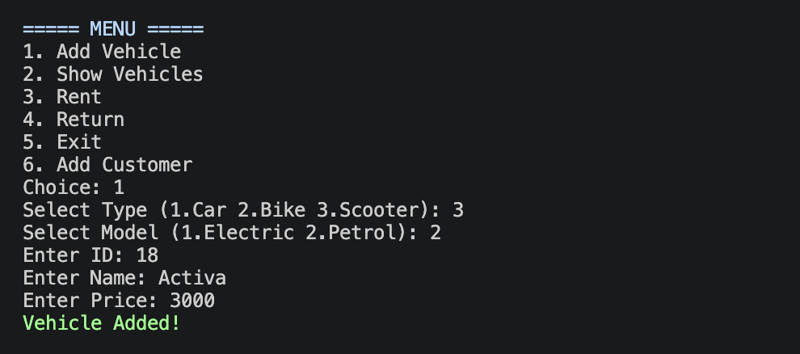
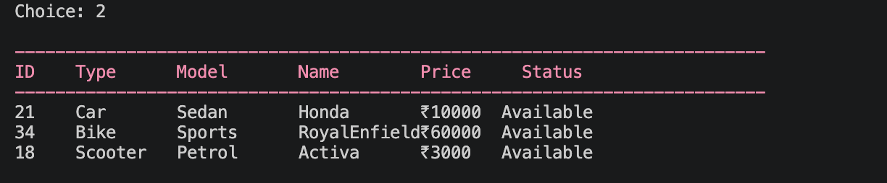
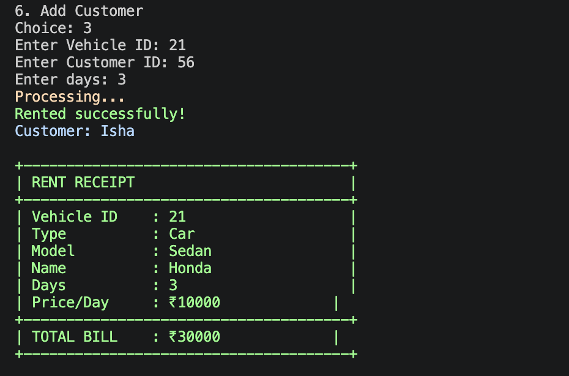

# Vehicle Renting Management System
## Introduction
This C++ project was designed as a course project during semester 2, it has two interfaces one for the owner and the other is for customers. The code is designed with different text colours to make it look more interactive and text seems animated using thread sleep.

## Features
1. Add Vehicle
2. Show Vehicles
3. Rent
4. Return
5. Exit
6. Add Customer

   

It deals with all kinds of errors like incorrect datatype entered, trying to rent a vehicle that doesnt exist. It calculates the rent and displays it in a bill format.

It asks for what sort of vehicle you want:
Car
Scooter
Bike
within you can choose either a sedan or suv, ev or petrol, sports or cruiser for a bike.

